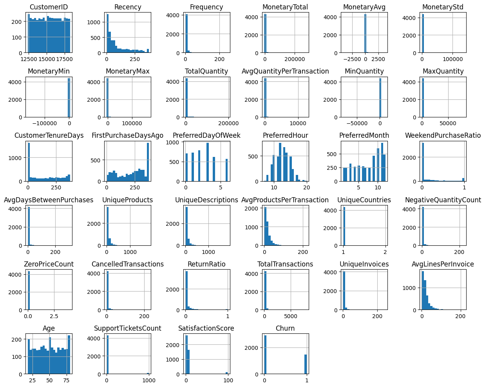
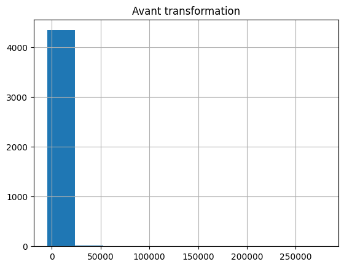
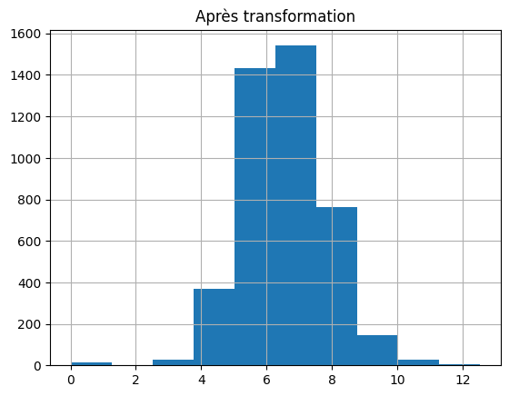

# Data Overview

 Contexte du projet 

Ce projet a pour objectif d’analyser le comportement des clients d’un e-commerce afin de mieux comprendre leurs habitudes et prédire le churn (départ des clients).

L’analyse repose sur un dataset riche contenant des données transactionnelles, comportementales et démographiques.

 Chargement des données

Les données ont été chargées dynamiquement à partir d’un fichier CSV en utilisant une variable d’environnement.

load_dotenv('../.env')

path = os.getenv('RAW_DATA_PATH')

df = pd.read_csv(f"../{path}")

→ Cette approche permet :

▪ une meilleure organisation du projet.

▪ une sécurisation des chemins de données.

▪ une flexibilité pour changer de dataset facilement.

 Structure du dataset

df.shape 

df.info()

✔️ Observations :

Le dataset contient un grand nombre de variables (~52 features).

↪ Nombre de variables

52 features au total de types mixtes :

 ● numériques (int, float)

 ● catégorielles (object)

↪ Variable cible : Churn

0 → Client fidèle

1 → Client ayant quitté

 Analyse descriptive

df.describe()

✔️ Observations :

▪ Présence de valeurs extrêmes dans certaines variables (ex : MonetaryTotal)

▪ Certaines variables ont une dispersion importante (écart-type élevé)

▪ Les distributions ne sont pas toujours normales (asymétrie).

→ Cela indique que :

▪ des transformations seront nécessaires (ex : log transformation)

▪ certaines variables devront être normalisées.

⚠️ Problèmes détectés

1. Valeurs manquantes
colonne Age contient un nombre important de valeurs manquantes (~30%)

2. Valeurs aberrantes
▪ Quantités négatives (erreurs ou retours produits)

▪ Valeurs incohérentes dans certaines variables (SupportTickets, ...)

3. Données incohérentes
▪ Formats de dates différents (RegistrationDate)

▪ Données IP non exploitables directement (LastLoginIP)

4. Variables inutiles
Newsletter → valeur constante (aucune information utile)

 Cardinalité des variables

df.nunique()

✔️ Observations :

▪ Certaines colonnes ont une forte cardinalité (ex : CustomerID)

▪ D’autres ont peu de valeurs uniques (catégories)

→ forte cardinalité → encodage spécifique possible

→ faible cardinalité → one-hot encoding adapté

 Doublons et unicité

df.duplicated().sum()

df['CustomerID'].is_unique

✔️ Observations :

Vérification de la présence de doublons

Validation de l’unicité des identifiants clients

↪ Important pour garantir :

la qualité des données

l’absence de biais dans les modèles

 Vérification des bornes Age, SupportTicketsCount, MonetaryTotal

✔️ Observations :

Présence de valeurs incohérentes possibles :

Age hors intervalle normal

valeurs négatives ou extrêmes

↪ Ces anomalies devront être corrigées dans l’étape de cleaning.

 Visualisation des données

df.hist()

## 📈 Distribution des variables numériques

La figure suivante montre la distribution des variables numériques:

✔️ Observations :

▪ Plusieurs variables présentent des distributions fortement asymétriques (skewed), avec une concentration des valeurs proches de zéro et une longue queue vers la droite.

▪ La présence de valeurs extrêmes (outliers), notamment dans les variables liées aux dépenses (MonetaryTotal, MonetaryMax) et aux quantités (TotalQuantity, MaxQuantity).

▪ Certaines variables contiennent des valeurs négatives, ce qui peut correspondre à des retours produits ou à des incohérences dans les données.

▪ Les variables ne sont pas normalisées et présentent des échelles très différentes.

🧠 Interprétation :

▪ L’asymétrie des distributions indique que les données ne suivent pas une loi normale, ce qui peut impacter négativement certains modèles de machine learning.

▪ Les valeurs extrêmes peuvent dominer l’apprentissage du modèle et introduire du bruit.

▪ La présence de valeurs négatives dans certaines variables nécessite une analyse métier pour distinguer entre données valides (retours) et erreurs.

▪ Les différences d’échelle entre variables peuvent biaiser les algorithmes sensibles aux distances (KNN, SVM, régression logistique).

⚙️ Implications pour le preprocessing 

Ces observations justifient les actions suivantes :

▪ Transformation logarithmique (ex : log1p) pour réduire l’asymétrie des variables fortement skewed (comme MonetaryTotal).

▪ Normalisation avec StandardScaler pour mettre toutes les variables sur une même échelle.

▪ Détection et traitement des outliers (suppression, clipping ou transformation).

▪ Analyse spécifique des valeurs négatives pour décider de leur traitement (conservation ou correction).

 Transformation logarithmique

df['MonetaryTotal_log'] = np.log1p(df['MonetaryTotal'])

### Avant transformation

### Après transformation (log1p)

✔️ Observations :

▪ La transformation réduit l’asymétrie

▪ Les données deviennent plus "normales"

↪ Ces transformations seront intégrées dans un pipeline de preprocessing afin d’assurer une préparation cohérente des données avant la phase de modélisation.

 Analyse des variables catégorielles

df.select_dtypes(include=['object'])

✔️ Observations :

▪ Plusieurs variables catégorielles avec différentes cardinalités

▪ Certaines catégories dominent fortement

↪ possible déséquilibre des classes

💾 Sauvegarde des données

↪ Permet de :

▪ conserver une version intermédiaire.

▪ faciliter les étapes suivantes du pipeline.

 Conclusion générale

Cette phase d’exploration a permis de mieux comprendre la structure et la qualité du dataset.

Les analyses ont mis en évidence plusieurs points importants :

▪ la présence de valeurs manquantes et d’anomalies

▪ des distributions fortement asymétriques

▪ des valeurs extrêmes pouvant impacter les modèles

▪ des variables nécessitant des transformations spécifiques

Ces observations confirment que les données ne sont pas directement exploitables pour le machine learning et nécessitent une phase de data cleaning et preprocessing approfondie.

→ La prochaine étape consistera à nettoyer, transformer et préparer les données afin de construire des modèles prédictifs performants.