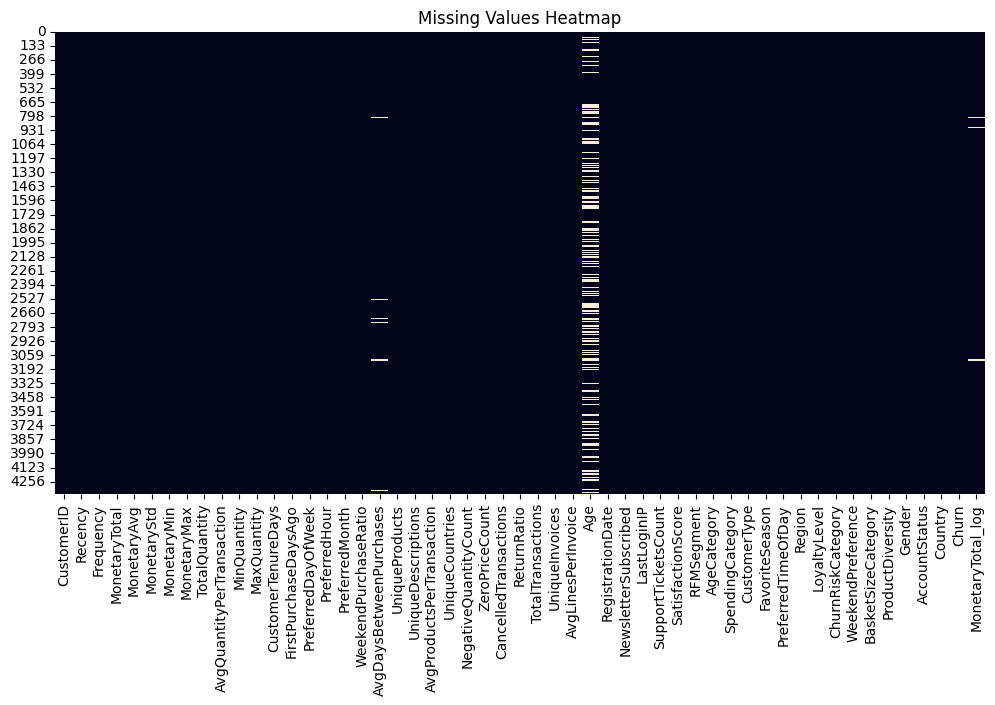
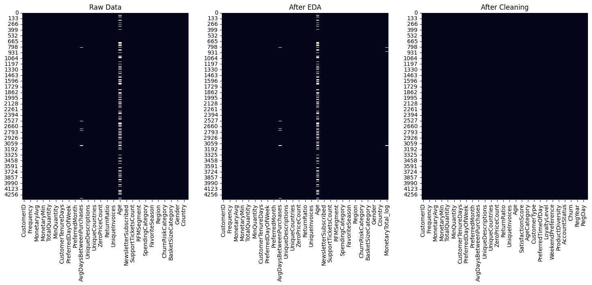
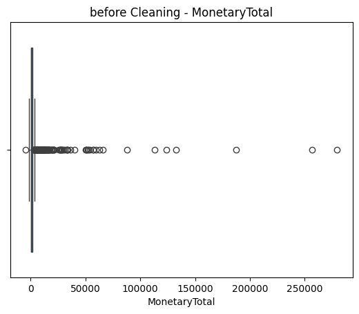
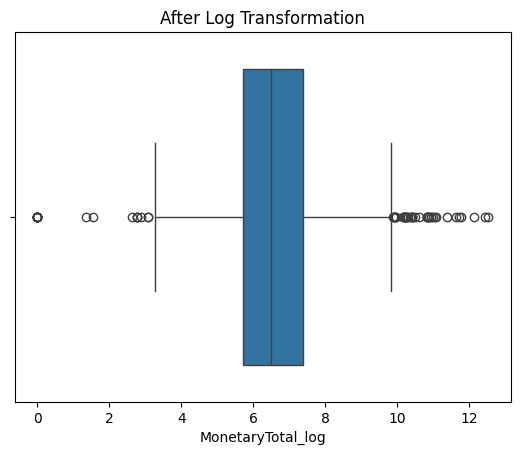
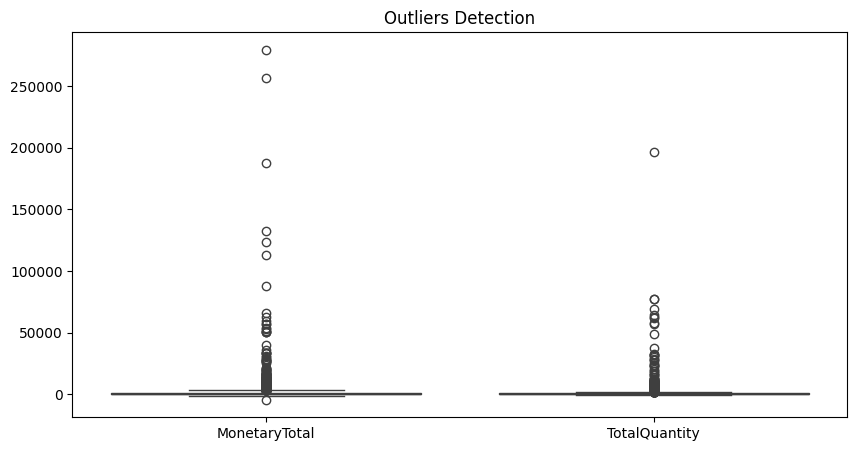
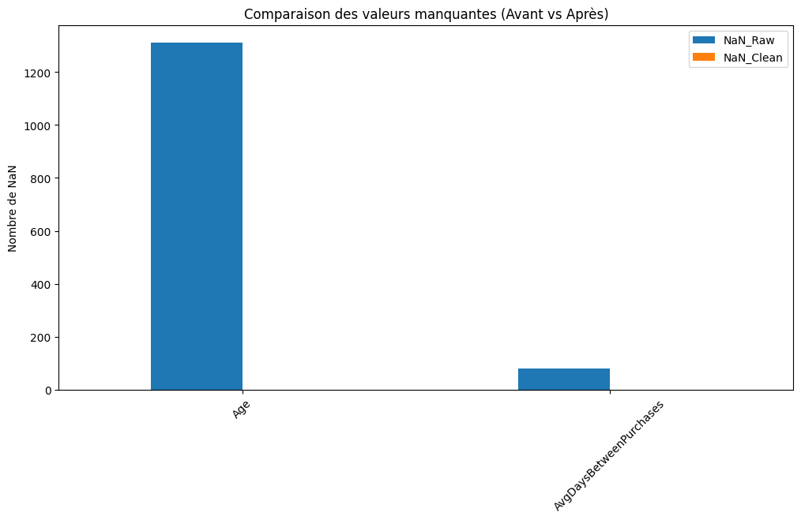
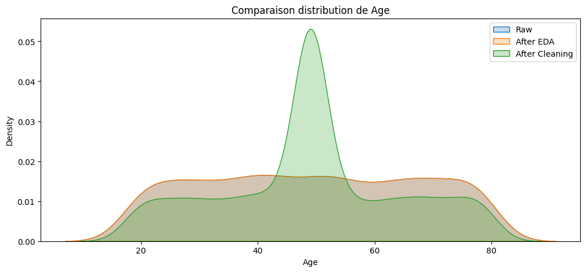

# data_cleaning

Après l'étape d'exploration, le dataset brut présentait :

- des valeurs manquantes dans plusieurs colonnes (ex: `Age`)  
- des valeurs aberrantes ou incohérentes (ex: `SupportTicketsCount`, `SatisfactionScore`)  
- des variables inutiles (`NewsletterSubscribed`, `LastLoginIP`)  
- des distributions fortement asymétriques et des outliers (ex: `MonetaryTotal`, `TotalQuantity`)  

L’objectif de cette étape était de **nettoyer les données**, corriger les anomalies et préparer le dataset pour le feature engineering et la modélisation.

## 1. Diagnostic initial

### Types et valeurs manquantes

df.info()
missing = df.isnull().sum().sort_values(ascending=False)
missing = missing[missing > 0]
print("Colonnes avec valeurs manquantes :")
print(missing)

✔️ Observations :

▪ La colonne Age contient environ 30% de valeurs manquantes.

▪ Certaines colonnes comme SupportTicketsCount et SatisfactionScore contiennent des valeurs aberrantes (-1, 99, 999).

## 2. Nettoyage des valeurs manquantes

### Age

Les valeurs manquantes sont remplacées par la médiane.

median_age = df['Age'].median()
df['Age'] = df['Age'].fillna(median_age)

✔️ Observations :

### AvgDaysBetweenPurchases

Remplissage des NaN avec la médiane.

df['AvgDaysBetweenPurchases'] = df['AvgDaysBetweenPurchases'].fillna(
    df['AvgDaysBetweenPurchases'].median()
)

### SupportTicketsCount et SatisfactionScore

Remplacement des valeurs aberrantes par NaN, puis imputation par la médiane.

df['SupportTicketsCount'] = df['SupportTicketsCount'].replace([-1, 999], np.nan)
df['SupportTicketsCount'] = df['SupportTicketsCount'].fillna(df['SupportTicketsCount'].median())

df["SatisfactionScore"] = df["SatisfactionScore"].replace([-1, 99], np.nan)
df["SatisfactionScore"] = df["SatisfactionScore"].fillna(df["SatisfactionScore"].median())

### MonetaryTotal
Application d'une transformation logarithmique pour réduire l'asymétrie.
df['MonetaryTotal_log'] = np.log1p(df['MonetaryTotal'])

✔️ Observations :

La transformation réduit l’impact des valeurs extrêmes et rapproche la distribution d’une forme plus normale.

## 3. Traitement des valeurs aberrantes

### Visualisation

sns.boxplot(data=df[['MonetaryTotal', 'TotalQuantity']])
plt.title("Outliers Detection")
plt.show()

### Correction

df['TotalQuantity'] = df['TotalQuantity'].clip(lower=0)
df['MinQuantity'] = df['MinQuantity'].clip(lower=0)

✔️ Observations :

Les valeurs négatives ont été corrigées.
Les outliers extrêmes sont atténués, notamment après log transformation. 

## 4. Suppression des features inutiles

df.drop("NewsletterSubscribed", axis=1, inplace=True)

df.drop("LastLoginIP", axis=1, inplace=True)

✔️ Justification :

Ces colonnes sont constantes ou non exploitables et n’apportent aucune valeur pour le ML.

## 5. Parsing et extraction des dates

### Conversion en datetime

df["RegistrationDate"] = pd.to_datetime(df["RegistrationDate"], dayfirst=True, errors="coerce")

### Extraction de nouvelles features

df['RegYear'] = df['RegistrationDate'].dt.year

df['RegMonth'] = df['RegistrationDate'].dt.month

df['RegDay'] = df['RegistrationDate'].dt.day

df['RegWeekday'] = df['RegistrationDate'].dt.weekday

### Suppression de la colonne originale

df.drop(columns=['RegistrationDate'], inplace=True)

## 6. Vérification post-cleaning

print("NaN restants :", df.isnull().sum().sum())
print("Shape final :", df.shape)
df.describe()
 
✔️ Observations :

▪ Toutes les valeurs manquantes ont été imputées.

▪ Les colonnes corrigées sont cohérentes pour la suite du pipeline.

## 7. Comparaison avant/après

✔️ Observations :

Le nettoyage et la log transformation ont réduit l’impact des outliers.
La variable est maintenant exploitable pour le ML.

✔️ Observations :

La distribution d’Age est plus homogène après nettoyage.
Les valeurs aberrantes ont été réduites et les NaN imputés.

## 8. Conclusion

La phase de cleaning a permis de corriger les valeurs manquantes, de traiter les anomalies, de supprimer les colonnes inutiles et d’appliquer une transformation logarithmique sur les variables fortement skewed.
La comparaison avant/après nettoyage montre une amélioration significative de la qualité des données, préparant ainsi le dataset pour la phase de feature engineering et de modélisation.

## 9. Sauvegarde finale

df.to_csv("../data/processed/step2_cleaning.csv", index=False)
print("Données sauvegardées")