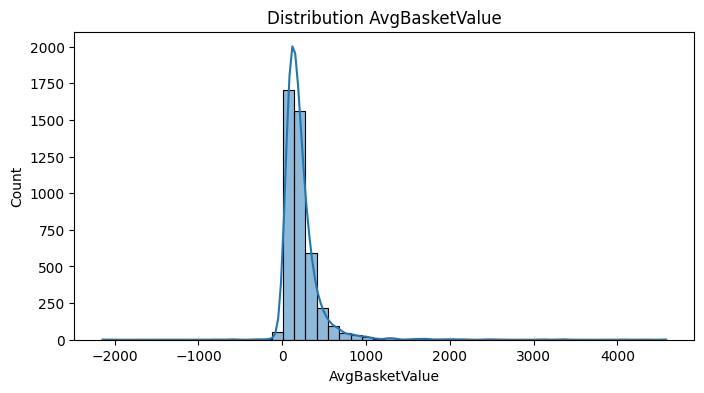
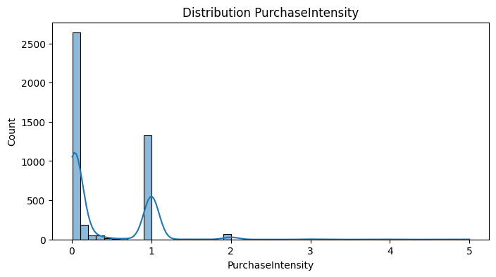
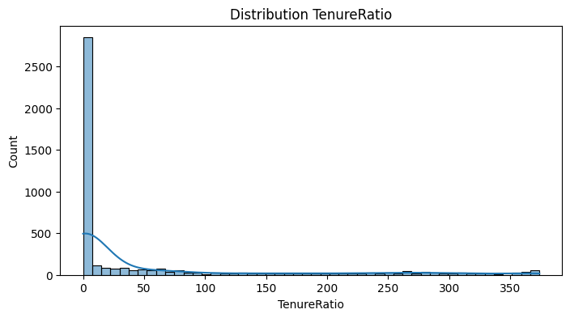
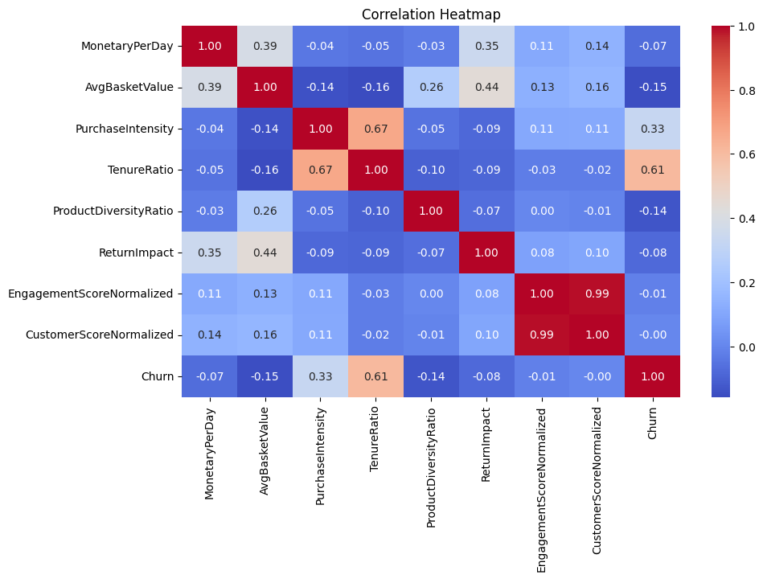
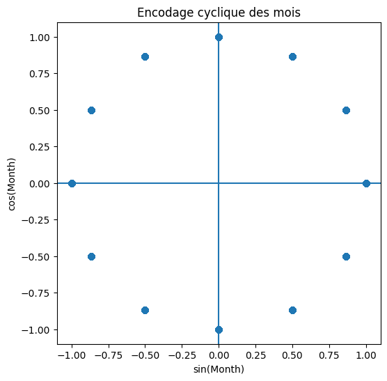
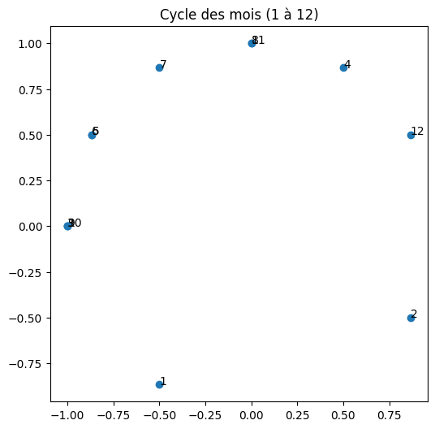

# Feature Engineering

## Objectif

L’objectif de cette étape est de transformer les données nettoyées en variables pertinentes pour améliorer la performance des modèles de Machine Learning dans la prédiction du churn client.

## Dataset d’entrée

Le dataset utilisé provient de l’étape précédente `cleaning`. En effet, après le nettoyage, les données sont cohérentes, sans doublons et avec un nombre minimal de valeurs manquantes.

### 🔹 Analyse rapide des colonnes

Séparation des colonnes numériques et catégorielles.

## 1. Création de nouvelles features numériques

### 1.1 Features basiques

#### ➤ MonetaryPerDay

df['MonetaryPerDay'] = df['MonetaryTotal'] / (df['Recency'] + 1)

→ Permet de mesurer la dépense moyenne quotidienne du client par jour.

#### ➤ AvgBasketValue

df['AvgBasketValue'] = df['MonetaryTotal'] / (df['Frequency'] + 1)

→ Indique le montant moyen dépensé par transaction. => client VIP vs petit client

#### ➤ PurchaseIntensity

df['PurchaseIntensity'] = df['Frequency'] / (df['CustomerTenureDays'] + 1)

→ Mesure la fréquence d’achat relative à l’ancienneté du client. => client fidèle ou pas

#### ➤ TenureRatio

df['TenureRatio'] = df['Recency'] / (df['CustomerTenureDays'] + 1)

→ Permet de détecter les clients inactifs. Permet de comparer ancienneté vs activité récente => détecter churn 

## 2. Distribution des nouvelles features

### 2.1 Histogrammes

La distribution de MonetaryPerDay montre une forte concentration de faibles valeurs, indiquant que la majorité des clients ont une activité faible, ce qui peut être un indicateur de churn.

✔️ Observations :

▪ Certaines variables présentent une distribution asymétrique.

▪ Les valeurs élevées de TenureRatio indiquent des clients inactifs.

### 2.2 Boxplots vs Churn

✔️ Observations :

▪ Les clients churn ont généralement une activité plus faible.

▪ Les clients avec un TenureRatio élevé sont plus susceptibles de churn.

### 2.3 Heatmap de corrélation

✔️ Observations :

La matrice de corrélation met en évidence plusieurs relations importantes :

▪ TenureRatio présente une forte corrélation avec le churn (0.61), ce qui indique qu’un client ancien mais inactif est plus susceptible de quitter.

▪ PurchaseIntensity montre une corrélation modérée (0.33), suggérant que l’activité client influence le churn.

▪ Une forte multicolinéarité est observée entre EngagementScoreNormalized et CustomerScoreNormalized (0.99), nécessitant la suppression d’une des deux variables.

▪ Certaines variables comme MonetaryPerDay ont un impact faible sur le churn.

## 3. Features comportementales

#### ➤ ProductDiversityRatio

df['ProductDiversityRatio'] = df['UniqueProducts'] / (df['Frequency'] + 1)

✔️ Observations :

▪ Mesure la diversité des produits achetés par le client.

▪ Une valeur élevée indique un client qui explore plusieurs produits, tandis qu’une valeur faible indique un comportement répétitif.

#### ➤ ReturnImpact

df['ReturnImpact'] = df['ReturnRatio'] * df['MonetaryTotal']

▪ Quantifie l’impact des retours sur la valeur du client.

▪ Permet d’identifier les clients à risque (beaucoup de retours + dépenses élevées).

#### ➤ EngagementScore

df['EngagementScore'] = df['Frequency'] + df['TotalQuantity'] + df['UniqueProducts']

✔️ Observations :

▪ Représente le niveau global d’activité du client.

▪ Plus le score est élevé, plus le client est actif.

#### ➤ EngagementScoreNormalized

df['EngagementScoreNormalized'] = df['EngagementScore'] / df['CustomerTenureDays']

✔️ Observations :

▪ Normalise l’engagement en fonction de l’ancienneté.

▪ Permet de comparer équitablement les clients récents et anciens.

#### ➤ CustomerScore

df['CustomerScore'] = (0.4 * df['Frequency'] + 0.4 * df['MonetaryTotal'] + 0.2 * df['Recency'])

✔️ Observations :

▪ Score global combinant activité, valeur et récence.

▪ Permet d’identifier les clients à fort potentiel.

#### ➤ CustomerScoreNormalized

df['CustomerScoreNormalized'] = df['CustomerScore'] / df['CustomerTenureDays']

✔️ Observations :

▪ Ajuste le score en fonction de la durée de vie du client.

▪ Évite de favoriser les clients anciens.

## 4. Transformation logarithmique

Certaines variables présentent une distribution très asymétrique avec des valeurs extrêmes (outliers).

Pour corriger cela, une transformation logarithmique est appliquée :    np.log1p()

📌 Objectifs :

▪ Réduire l’impact des valeurs extrêmes.

▪ Rendre les distributions plus homogènes.

▪ Améliorer la performance des modèles de Machine Learning.

📌 Interprétation :

Après transformation, les données sont mieux réparties, ce qui facilite l’apprentissage du modèle.

## 5. Encodage des variables

Les variables temporelles présentent une nature cyclique (ex : mois, jours).

Pour préserver cette propriété, un encodage basé sur les fonctions trigonométriques est utilisé :   

sin / cos

📌 Visualisation :

## 6. Sauvegardage

df.to_csv('../data/processed/step3_feature_engineering.csv', index=False)

## 7. CONCLUSION

Les différentes visualisations réalisées ont permis de valider la pertinence des nouvelles features.

Certaines variables, comme TenureRatio et MonetaryPerDay, montrent une relation claire avec le churn.

Les transformations appliquées (log, encodage, normalisation) ont amélioré la qualité des données et leur exploitabilité.

Le dataset est désormais prêt pour la phase de modélisation.
